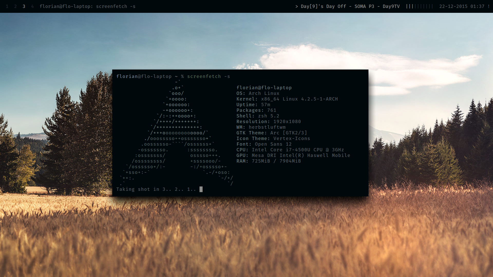

# My Dotfiles
This repository contains my personal dotfiles, as well as wallpapers.

## Configs
All configs are to be used with the `stow` utility. Just apply as needed. I use the default grml-zsh-config, which is the reason for hardly any zsh modding in this repository.

## Dependencies
### Applications
* [lighthouse](https://github.com/emgram769/lighthouse): Application Launcher
* [bar](https://github.com/LemonBoy/bar): The top bar
* [node/npm](https://nodejs.org/): JS runtime. Needed for some utilities
* [urxvt](https://wiki.archlinux.org/index.php/Rxvt-unicode): The terminal emulator
* [zsh](https://wiki.archlinux.org/index.php/Zsh): The shell
* [herbstluftwm](https://wiki.archlinux.org/index.php/Herbstluftwm): The window manager
* [compton](https://github.com/chjj/compton): An optional compositor
* [scrot](https://www.archlinux.org/packages/community/i686/scrot/): Take Screenshots
* [imagemagick](https://www.archlinux.org/packages/extra/i686/imagemagick/): Used to make screenshots pretty
* [dunst](https://github.com/knopwob/dunst): Used as a notification server

### NPM Modules
Some npm modules need to be globally installed. Namely

* [shtore](https://www.npmjs.com/package/shtore): cross-application JSON configs (e.g. colors)
* [confish](https://www.npmjs.com/package/confish): preparation of config files
* [wpmanager](https://www.npmjs.com/package/wpmanager): Management of wallpapers
* [quoty](https://www.npmjs.com/package/quoty): Quotes upon opening a terminal
