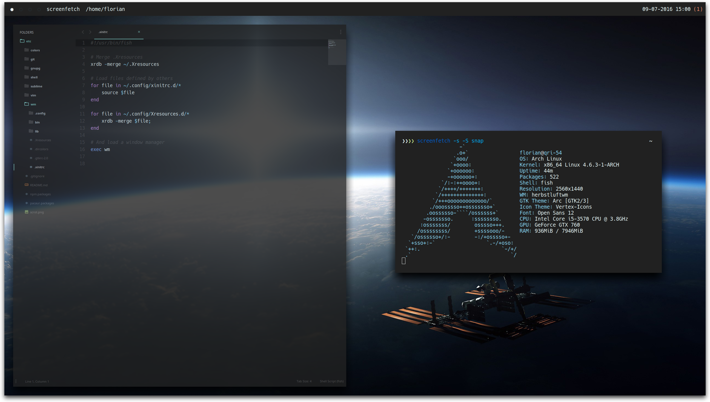

# My Dotfiles
This repository contains my personal dotfiles, as well as wallpapers.

## Configs
All configs are to be used with the `stow` utility. Just apply as needed.

## Dependencies
All dependencies can (or better, should. I tend to be an idiot about updating these) be found in the `npm.packages` and `pacaur.packages` files. They also contain most of the other stuff I usually install on my system.
